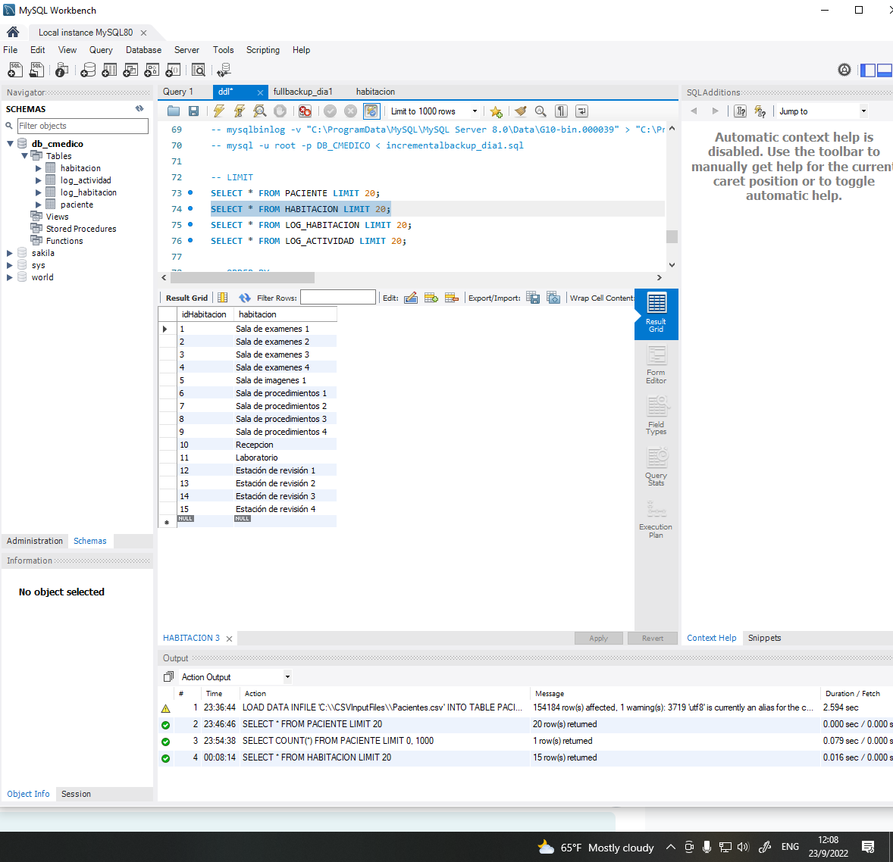
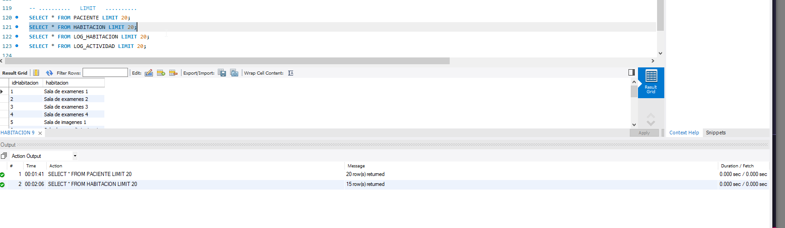
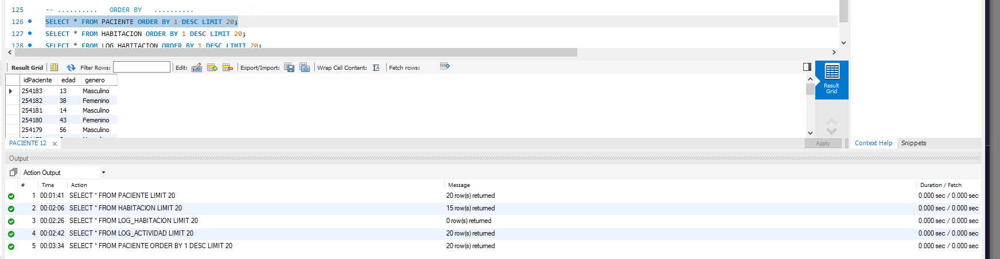
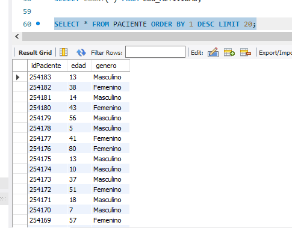
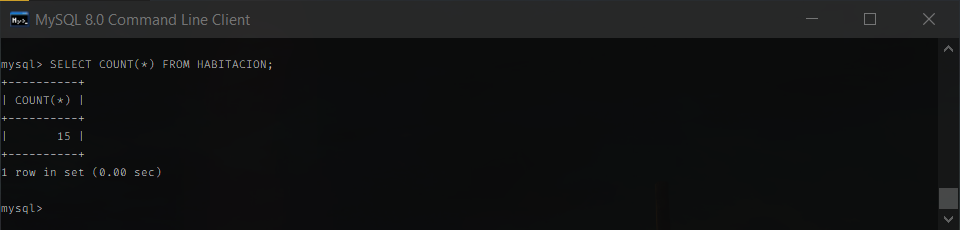
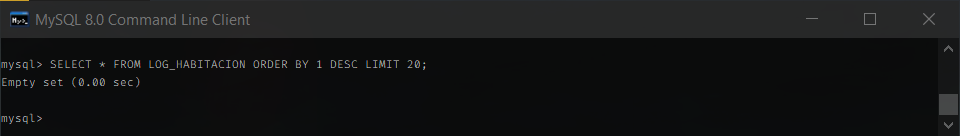
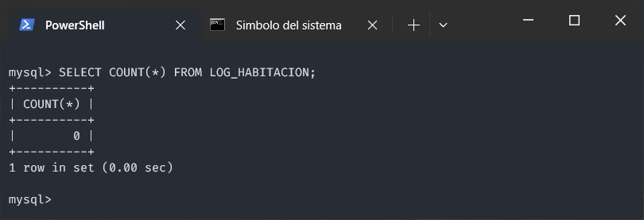
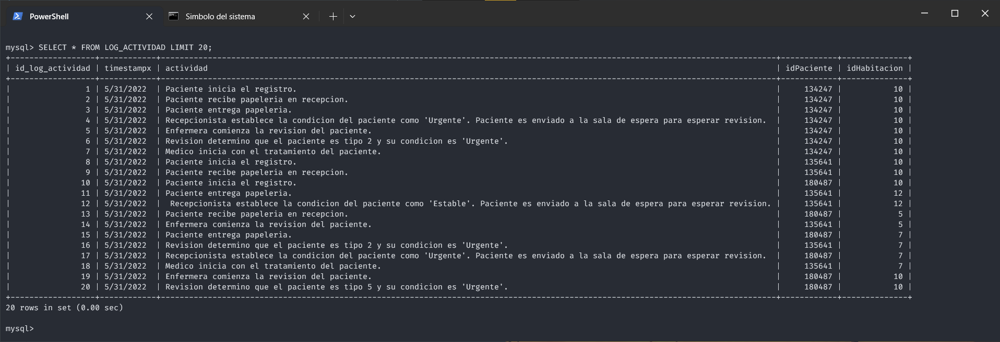

# **Análisis**
- [**Análisis**](#análisis)
- [:::::::::::::::::::   Capturas de pantalla    :::::::::::::::::::](#---capturas-de-pantalla----)
  - [**Full Backup**](#full-backup)
    - [**Día 1**](#día-1)
      - [**Tiempo de carga**](#tiempo-de-carga)
      - [**Backup**](#backup)
      - [**COUNTS**](#counts)
      - [**LIMITS**](#limits)
      - [**ORDERS**](#orders)
    - [**Día 2**](#día-2)
      - [**Tiempo de carga**](#tiempo-de-carga-1)
      - [**Backup**](#backup-1)
      - [**COUNTS**](#counts-1)
      - [**LIMITS**](#limits-1)
      - [**ORDERS**](#orders-1)
    - [**Día 3**](#día-3)
      - [**Tiempo de carga**](#tiempo-de-carga-2)
      - [**Backup**](#backup-2)
      - [**COUNTS**](#counts-2)
      - [**LIMITS**](#limits-2)
      - [**ORDERS**](#orders-2)
    - [**Día 4**](#día-4)
      - [**Tiempo de carga**](#tiempo-de-carga-3)
      - [**Backup**](#backup-3)
      - [**COUNTS**](#counts-3)
      - [**LIMITS**](#limits-3)
      - [**ORDERS**](#orders-3)
    - [**Día 5**](#día-5)
      - [**Tiempo de carga**](#tiempo-de-carga-4)
      - [**Backup**](#backup-4)
      - [**COUNTS**](#counts-4)
      - [**LIMITS**](#limits-4)
      - [**ORDERS**](#orders-4)
  - [**Incremental Backup**](#incremental-backup)
    - [**Día 1**](#día-1-1)
      - [**Tiempo de carga**](#tiempo-de-carga-5)
      - [**Backup**](#backup-5)
      - [**COUNTS**](#counts-5)
      - [**LIMITS**](#limits-5)
      - [**ORDERS**](#orders-5)
    - [**Día 2**](#día-2-1)
      - [**Tiempo de carga**](#tiempo-de-carga-6)
      - [**Backup**](#backup-6)
      - [**COUNTS**](#counts-6)
      - [**LIMITS**](#limits-6)
      - [**ORDERS**](#orders-6)
    - [**Día 3**](#día-3-1)
      - [**Tiempo de carga**](#tiempo-de-carga-7)
      - [**Backup**](#backup-7)
      - [**COUNTS**](#counts-7)
      - [**LIMITS**](#limits-7)
      - [**ORDERS**](#orders-7)
    - [**Día 4**](#día-4-1)
      - [**Tiempo de carga**](#tiempo-de-carga-8)
      - [**Backup**](#backup-8)
      - [**COUNTS**](#counts-8)
      - [**LIMITS**](#limits-8)
      - [**ORDERS**](#orders-8)
    - [**Día 5**](#día-5-1)
      - [**Tiempo de carga**](#tiempo-de-carga-9)
      - [**Backup**](#backup-9)
      - [**COUNTS**](#counts-9)
      - [**LIMITS**](#limits-9)
      - [**ORDERS**](#orders-9)
- [:::::::::::::::::::   Análisis de resultados  :::::::::::::::::::](#---análisis-de-resultados--)
- [:::::::::::::::::::   Conclusiones    :::::::::::::::::::](#---conclusiones----)

<!-- :::::::::::::::::::::::::::::::::::::::::::::::::::::::::::::: -->
# :::::::::::::::::::   Capturas de pantalla    :::::::::::::::::::
<!-- :::::::::::::::::::::::::::::::::::::::::::::::::::::::::::::: -->
## **Full Backup**
<!-- :::::::::::::::::::::::::::::::::::::::::::::::::::::::::::::: -->
<!-- ______________________________________________________________ -->
### **Día 1**

#### **Tiempo de carga**

- [Habitaciones.csv](Archivos%20de%20carga/CSVInputFiles/Habitaciones.csv)

    

#### **Backup**

- [fullbackup_dia1.sql](Backups/Full/Dia_1/fullbackup_dia1.sql)

#### **COUNTS**

- Paciente

    

- Habitación

    

- Log Actividad

    

- Log Habitación

    

#### **LIMITS**

- Paciente

    

- Habitación

    

- Log Actividad

    

- Log Habitación

    

#### **ORDERS**

- Paciente

    

- Habitación

    

- Log Actividad

    

- Log Habitación

    
<!-- ______________________________________________________________ -->
### **Día 2**

#### **Tiempo de carga**

- [Pacientes.csv](Archivos%20de%20carga/CSVInputFiles/Pacientes.csv)

    

#### **Backup**

- [fullbackup_dia2.sql](Backups/Full/Dia_2/fullbackup_dia2.sql)

#### **COUNTS**

- Paciente

    

- Habitación

    

- Log Actividad

    

- Log Habitación

    

#### **LIMITS**

- Paciente

    

- Habitación

    

- Log Actividad

    

- Log Habitación

    

#### **ORDERS**

- Paciente

    

- Habitación

    

- Log Actividad

    

- Log Habitación

    
<!-- ______________________________________________________________ -->
### **Día 3**

#### **Tiempo de carga**

- [LogActividades1.csv](Archivos%20de%20carga/CSVInputFiles/LogActividades1.csv)

    

#### **Backup**

- [fullbackup_dia3.sql](Backups/Full/Dia_3/fullbackup_dia3.sql)

#### **COUNTS**

- Paciente

    

- Habitación

    

- Log Actividad

    

- Log Habitación

    

#### **LIMITS**

- Paciente

    

- Habitación

    

- Log Actividad

    

- Log Habitación

    

#### **ORDERS**

- Paciente

    

- Habitación

    

- Log Actividad

    

- Log Habitación

    
<!-- ______________________________________________________________ -->
### **Día 4**

#### **Tiempo de carga**

- [LogActividades2.csv](Archivos%20de%20carga/CSVInputFiles/LogActividades2.csv)

    

#### **Backup**

- [fullbackup_dia4.sql](Backups/Full/Dia_4/fullbackup_dia4.sql)

#### **COUNTS**

- Paciente

    

- Habitación

    

- Log Actividad

    

- Log Habitación

    

#### **LIMITS**

- Paciente

    

- Habitación

    

- Log Actividad

    

- Log Habitación

    

#### **ORDERS**

- Paciente

    

- Habitación

    

- Log Actividad

    

- Log Habitación

    
<!-- ______________________________________________________________ -->
### **Día 5**

#### **Tiempo de carga**

- [LogHabitacion.csv](Archivos%20de%20carga/CSVInputFiles/LogHabitacion.csv)

    

#### **Backup**

- [fullbackup_dia5.sql](Backups/Full/Dia_5/fullbackup_dia5.sql)

#### **COUNTS**

- Paciente

    

- Habitación

    

- Log Actividad

    

- Log Habitación

    

#### **LIMITS**

- Paciente

    

- Habitación

    

- Log Actividad

    

- Log Habitación

    

#### **ORDERS**

- Paciente

    

- Habitación

    

- Log Actividad

    

- Log Habitación

    
<!-- :::::::::::::::::::::::::::::::::::::::::::::::::::::::::::::: -->
## **Incremental Backup**
<!-- :::::::::::::::::::::::::::::::::::::::::::::::::::::::::::::: -->
<!-- ______________________________________________________________ -->
### **Día 1**

#### **Tiempo de carga**

- [Habitaciones.csv](Archivos%20de%20carga/CSVInputFiles/Habitaciones.csv)

    

#### **Backup**

- [incrementalbackup_dia1_1.sql](Backups/Incremental/Dia_1/incrementalbackup_dia1_1.sql)

#### **COUNTS**
- Paciente

    

- Habitación

    

- Log Actividad

    

- Log Habitación

    

#### **LIMITS**

- Paciente

    

- Habitación

    

- Log Actividad

    

- Log Habitación

    

#### **ORDERS**

- Paciente

    

- Habitación

    

- Log Actividad

    

- Log Habitación

    
<!-- ______________________________________________________________ -->
### **Día 2**

#### **Tiempo de carga**

- [Pacientes.csv](Archivos%20de%20carga/CSVInputFiles/Pacientes.csv)

    

#### **Backup**

- [incrementalbackup_dia2_1.sql](Backups/Incremental/Dia_2/incrementalbackup_dia2_1.sql)

#### **COUNTS**
- Paciente

    

- Habitación

    

- Log Actividad

    

- Log Habitación

    

#### **LIMITS**

- Paciente

    

- Habitación

    

- Log Actividad

    

- Log Habitación

    

#### **ORDERS**

- Paciente

    

- Habitación

    

- Log Actividad

    

- Log Habitación

    
<!-- ______________________________________________________________ -->
### **Día 3**

#### **Tiempo de carga**

- [LogActividades1.csv](Archivos%20de%20carga/CSVInputFiles/LogActividades1.csv)

    

#### **Backup**

- [incrementalbackup_dia3.sql](Backups/Incremental/Dia_3/incrementalbackup_dia3.sql)

#### **COUNTS**
- Paciente

    

- Habitación

    

- Log Actividad

    

- Log Habitación

    

#### **LIMITS**

- Paciente

    

- Habitación

    

- Log Actividad

    

- Log Habitación

    

#### **ORDERS**

- Paciente

    

- Habitación

    

- Log Actividad

    

- Log Habitación

    
<!-- ______________________________________________________________ -->
### **Día 4**

#### **Tiempo de carga**

- [LogActividades2.csv](Archivos%20de%20carga/CSVInputFiles/LogActividades2.csv)

    

#### **Backup**

- [incrementalbackup_dia4.sql](Backups/Incremental/Dia_4/incrementalbackup_dia4.sql)

#### **COUNTS**
- Paciente

    

- Habitación

    

- Log Actividad

    

- Log Habitación

    

#### **LIMITS**

- Paciente

    

- Habitación

    

- Log Actividad

    

- Log Habitación

    

#### **ORDERS**

- Paciente

    

- Habitación

    

- Log Actividad

    

- Log Habitación

    
<!-- ______________________________________________________________ -->
### **Día 5**

#### **Tiempo de carga**

- [LogHabitacion.csv](Archivos%20de%20carga/CSVInputFiles/LogHabitacion.csv)

    

#### **Backup**

- [incrementalbackup_dia5.sql](Backups/Incremental/Dia_5/incrementalbackup_dia5.sql)

#### **COUNTS**
- Paciente

    

- Habitación

    

- Log Actividad

    

- Log Habitación

    

#### **LIMITS**

- Paciente

    

- Habitación

    

- Log Actividad

    

- Log Habitación

    

#### **ORDERS**

- Paciente

    

- Habitación

    

- Log Actividad

    

- Log Habitación

    
<!-- :::::::::::::::::::::::::::::::::::::::::::::::::::::::::::::: -->
# :::::::::::::::::::   Análisis de resultados  :::::::::::::::::::
<!-- :::::::::::::::::::::::::::::::::::::::::::::::::::::::::::::: -->

<!-- :::::::::::::::::::::::::::::::::::::::::::::::::::::::::::::: -->
# :::::::::::::::::::   Conclusiones    :::::::::::::::::::
<!-- :::::::::::::::::::::::::::::::::::::::::::::::::::::::::::::: -->
